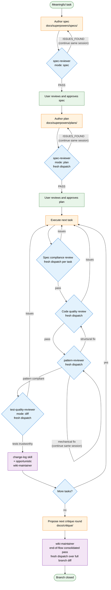

# Spec-Driven Development

End-to-end walkthrough of a meaningful implementation task using the scaffold's agents and skills, from spec authoring to branch closure. The loop shape is the canonical **spec-driven development** flow: design intent → plan shape → implementation → multi-stage review → critique handoff → final docs.

## Framework compatibility

This loop was developed and validated against the [Superpowers](https://github.com/anthropics/superpowers) workflow framework — specifically, the subagent-driven-development pattern, extended here to four review stages (spec compliance → code quality → pattern → test quality). The scaffold's agents and skills are framework-agnostic, though: any spec-driven pipeline that has analogous stages (a pre-implementation review gate, an in-loop review pass, a documentation step) can host them.

When adapting to a different framework, the durable shape is:

- A **spec author** stage with a fresh-eyes review gate before user validation.
- A **plan author** stage with the same review gate, dispatched fresh per artifact.
- An **execution** stage that may dispatch subagents per task.
- A **multi-stage review** loop where pattern review and test-quality review are each a separate dispatch, distinct from code-quality review.
- A **documentation** trace (change-log entry + opportunistic broader doc updates).
- A **consolidated end-of-flow** documentation pass at branch closure.

The agents and skills here slot into those stages regardless of which framework owns the orchestration.

## Loop shape

**Spec → Plan → Execute → Review → Critique → Final-Docs**

Each stage has a primary actor (the model running in the main session, henceforth "the orchestrator") and one or more dispatched agents or invoked skills.

## Visual flow

Legend:

- **Orange (rectangles):** orchestrator actions — authoring, executing, proposing.
- **Blue (diamonds):** review gates — agents that classify and report.
- **Purple (rectangles):** documentation skills and the wiki-maintainer end-of-flow pass.
- **Green (rounded):** user-touch points (start, approval gates, branch close).

The annotations on edges (`continue same session`, `fresh dispatch`) call out the [reviewer-session-continuation](../conventions/reviewer-session-continuation.md) and [per-task-fresh-dispatches](../conventions/per-task-fresh-dispatches.md) discipline that holds the loop together.

## Stage 1 — Spec

The orchestrator authors a design spec at `docs/superpowers/specs/<date>-<slug>.md` (or your project's equivalent path).

Then routes through `spec-reviewer` **before** asking the user for validation:

1. Generate the spec.
2. Self-review and address obvious issues.
3. Dispatch `spec-reviewer` in spec-review mode:

   > Dispatch `spec-reviewer` (mode: spec) against `docs/superpowers/specs/2026-05-10-feature-x.md`. Name the session `spec-reviewer-feature-x` so revision rounds can continue it.

4. If verdict is `ISSUES_FOUND`, address findings, then continue the same session for re-review.
5. Repeat until verdict is `PASS`. The PASS bar is constant across rounds — do not soften.
6. Only after `PASS`, ask the user whether to proceed.

Then close the `spec-reviewer-feature-x` session — its work is done.

## Stage 2 — Plan

Author an implementation plan at `docs/superpowers/plans/<date>-<slug>.md`.

Plan review is a **separate fresh dispatch** of `spec-reviewer`, not a SendMessage-resume of the spec-mode session:

> Dispatch `spec-reviewer` (mode: plan) with spec at `docs/superpowers/specs/2026-05-10-feature-x.md`, plan at `docs/superpowers/plans/2026-05-10-feature-x.md`, and touched source paths [list]. Name the session `spec-reviewer-plan-feature-x`.

Same revision-round protocol until `PASS`. Then close the plan-review session and present to the user.

## Stage 3 — Execute

Implement against the plan. The orchestrator either implements directly or dispatches subagents per the project's subagent-driven-development workflow.

For multi-task plans using subagents, each task gets its own subagent dispatch. Each subagent's diff goes through the implementation-review sub-loop in Stage 4.

## Stage 4 — Review

For each task's diff, four review stages, each a **separate dispatch**:

### 4a. Spec compliance

Dispatch a spec-compliance reviewer (typically the orchestrator's general-purpose review path with a spec-compliance prompt):

> Spec-compliance review of Task N's diff against the spec. Verify every spec requirement is covered, no scope creep, no missing tests.

### 4b. Code quality

Separate dispatch with a code-quality prompt:

> Code-quality review of Task N's diff. Verify correctness, readability, maintainability.

### 4c. Pattern review

Dispatch `pattern-reviewer` with the appropriate `mode:`:

> Dispatch `pattern-reviewer` with `mode: backend` against Task N's diff. Spec compliance and code quality have passed.

If pattern-reviewer flags issues:

- Implementer fixes them.
- Pattern re-review continues the same `pattern-reviewer` session.
- If the fix was structural (new files, changed interfaces, extracted layer), loop back to code-quality review before final pattern re-review.
- If the fix was mechanical (field vs property, switch arm, namespace swap), skip back to pattern re-review.

**Important:** each task's four stages are fresh dispatches per stage per task. Do not SendMessage-resume a reviewer that completed a prior task's review on a new task's diff. See [`docs/conventions/per-task-fresh-dispatches.md`](../conventions/per-task-fresh-dispatches.md).

### 4d. Test quality

Dispatch `test-quality-reviewer` in `mode: diff`:

> Dispatch `test-quality-reviewer` with `mode: diff` against Task N's diff. Spec compliance, code quality, and pattern review have passed.

If test-quality-reviewer flags issues:

- Implementer fixes them.
- Test-quality re-review continues the same `test-quality-reviewer` session.
- The `PASS` / `ISSUES_FOUND` bar is constant across revision rounds.

This stage reviews test-code trustworthiness and test design — whether the task's tests actually protect the behavior they claim to. It is distinct from code-quality review, which inspects the production code. See [`docs/agents/test-quality-reviewer.md`](../agents/test-quality-reviewer.md).

### 4e. Per-task documentation

After review passes, the orchestrator (or a dispatched `wiki-maintainer` if broader doc impact is visible) updates docs and runs the `change-log` skill:

> Use the `change-log` skill to record the Task N landing in `docs/change-log.md`.

## Stage 5 — Critique handoff

For meaningful work that affects gameplay, tuning, AI behavior, progression, or rewards (or whatever your project's analogous "feel" surface is), propose the next critique round in `docs/critique/` unless the user explicitly says to skip or the change is clearly diagnostics / docs / tooling-only.

This is a project-specific stage; not every project has a critique loop. Adopt only if your project benefits from periodic structured critique against validated checkpoints.

## Stage 6 — Final-Docs (branch closure)

Immediately before branch merge / PR / closure, dispatch `wiki-maintainer` once against the **full branch diff** for a consolidated end-of-flow doc pass:

> Dispatch `wiki-maintainer` for the end-of-flow consolidated pass. Use the diff-driven primary workflow against the full branch diff (`git diff <base-branch>...HEAD`). This is a fresh dispatch — not a SendMessage-resume of any per-task `wiki-maintainer` session. Cross-task coherence drift is the priority.

This stage is mandatory by default even when per-task `change-log` and per-task `wiki-maintainer` dispatches already ran during execution. Cross-task coherence drift only becomes visible at the bundle level.

## Continuation discipline summary

- **Same artifact, multi-round:** continue the same reviewer session (e.g., `spec-reviewer-feature-x` across spec-review revision rounds).
- **New artifact (different spec, plan, task, audit, asset slot):** fresh dispatch.
- **Continuation failure:** try ID-based addressing, then fall back to fresh dispatch carrying findings as context.

See [`docs/conventions/reviewer-session-continuation.md`](../conventions/reviewer-session-continuation.md) and [`docs/conventions/per-task-fresh-dispatches.md`](../conventions/per-task-fresh-dispatches.md).

## Skip rules

The full loop applies to **meaningful implementation tasks**. The following work types skip parts of the loop:

- **Docs-only changes:** skip Spec / Plan, run `wiki-maintainer` directly, run the `change-log` skill if log-worthy.
- **Diagnostics-only changes:** skip Critique, run `wiki-maintainer` opportunistically.
- **Tooling-only changes:** skip Critique, follow Spec / Plan if the change is non-trivial.
- **Trivial changes:** skip everything except the implementation and an optional `change-log` entry.

The standard development workflow is for *meaningful* work. Trivial changes shouldn't drag the full loop along.
